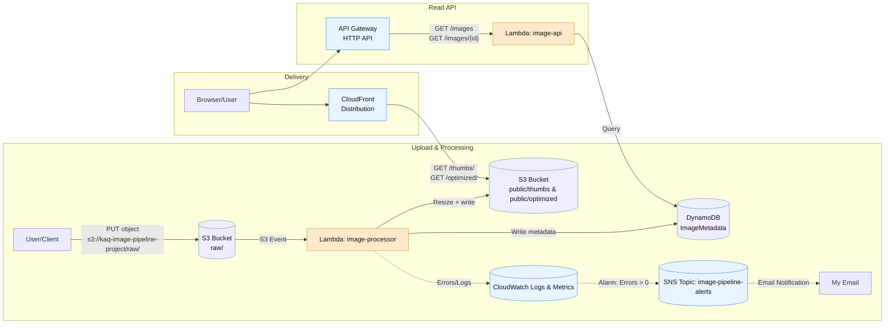

# AWS Image Processing Pipeline

## Overview
This project is a serverless image processing pipeline built on AWS.  
It automatically optimizes and generates thumbnails for uploaded images, stores them in S3, and serves them securely through CloudFront.  

It also has monitoring with CloudWatch and error notifications via SNS.

## Architecture
- **S3** → Raw image uploads trigger processing.  
- **Lambda (image-processor)** → Resizes images (thumbnail + optimized).  
- **DynamoDB** → Stores metadata about each image.  
- **API Gateway + Lambda (image-api)** → Provides REST API to fetch image metadata.  
- **CloudFront** → CDN for caching and fast global delivery.  
- **SNS + CloudWatch** → Alerts when errors occur.  


```mermaid
flowchart TB
  subgraph Clients
    UA[User A (App / Mobile / Web)]
    UB[User B (App / Mobile / Web)]
  end

  subgraph Frontend["Frontend / Gateway"]
    FE[API Gateway / Websockets]
    Auth[Auth & Consent Service]
  end

  subgraph Chatbots["Chatbot Layer"]
    BotSvc[Chatbot Service (per-user agent)]
  end

  subgraph DataPlane["Data Plane (Encrypted)"]
    Conv[Conversation Store (S3 / object store)]
    Feature[Feature Extraction / NLP Pipeline]
    Vector[Vector DB (Pinecone / Milvus / FAISS)]
    Profiles[Profile DB (Postgres)]
  end

  subgraph Matching["Matching & Mediation"]
    MatchEngine[Matching Engine (ANN + Ranker)]
    Mediator[Compatibility Mediator Agent]
    ProbeBank[Probe Template Bank]
    ProbeOrch[Probe Orchestrator / Queue]
    DecisionSvc[Decision & Scoring Service]
  end

  subgraph Interaction["User Interaction"]
    Notif[Notification Service]
    UIChat[Direct / Mediated Chat Service]
  end

  subgraph Ops["Ops & Security"]
    Audit[Audit & Consent Logs (immutable)]
    IAM[KMS / Secrets / RBAC]
    Observ[Monitoring & Tracing]
  end

  %% Connections
  UA -->|chat messages| FE
  UB -->|chat messages| FE

  FE --> Auth
  FE --> BotSvc
  BotSvc --> Conv
  Conv --> Feature
  Feature --> Vector
  Feature --> Profiles

  Vector --> MatchEngine
  Profiles --> MatchEngine
  MatchEngine --> Mediator
  Mediator --> ProbeOrch
  ProbeOrch --> ProbeBank
  ProbeOrch --> BotSvc
  BotSvc -->|aggregated response| ProbeOrch
  ProbeOrch --> Mediator
  Mediator --> DecisionSvc
  DecisionSvc --> MatchEngine
  DecisionSvc --> Notif
  Notif --> UA
  Notif --> UB
  Notif --> UIChat
  UA -->|open chat| UIChat
  UB -->|open chat| UIChat

  %% Ops links
  Conv -->|audit write| Audit
  ProbeOrch -->|audit write| Audit
  Auth -->|consent record| Audit
  IAM --> Conv
  IAM --> Profiles
  Observ --> BotSvc
  Observ --> Mediator

  %% Privacy boundary
  classDef boundary stroke-dasharray: 5 5,stroke:#666,stroke-width:2px;
  subgraph "PRIVACY BOUNDARY — Only aggregated labels & encrypted vectors cross" style boundary
    Feature
    Vector
    Profiles
    ProbeOrch
    Mediator
  end
```

## Services Used
- Amazon S3  
- AWS Lambda  
- Amazon DynamoDB  
- API Gateway  
- Amazon CloudFront  
- Amazon SNS  
- Amazon CloudWatch  

## Screenshots
See Screenshot Folder for:
1. S3/raw
2. S3/public/optimized
3. S3/public/thumbs
4. Lambda/image-processor
5. Lambda/image-api
6. DynamoDB
7. API-list
8. API-Single item
9. CloudFront
10. CloudWatch Alarm
11. SNS Email
12. Architecture
    

## How to Use
1. Upload an image (PNG/JPG) to the S3 `raw/` folder.  
2. Lambda resizes and stores `public/thumbs/` and `public/optimized/`.  
3. Metadata is written to DynamoDB.  
4. Fetch metadata via API Gateway endpoint.  
5. Serve images globally via CloudFront domain.  

## License
This project is licensed under the MIT License – see the LICENSE file for details.
